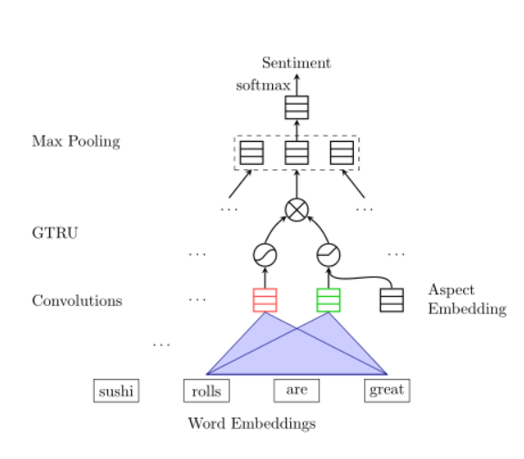
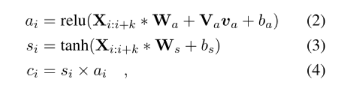

- ACL 2018 LongPaper
- [code](https://github.com/wxue004cs/GCAE)
- Introduction
    - 已有的大部分方法都是利用LSTM和注意力机制进行建模，但二者时间复杂度很高
    - 利用多种不同尺寸的卷积核抽取多粒度的n-gram特征。门控单元可以选择性的抽取评价对象相关的情感信息。
      "Average to good Thai food, but terrible delivery". 当评价对象是food的时候，门控单元可以自动忽略第二个子句对delivery的负向情感
    - 对于Aspect-term 的任务，再利用一个卷积核去进行实体表示
    - Convolutional layers with multiple filters can efficiently extract n-gram features at many granularities on each receptive field.
    The proposed gating units have two nonlinear gates, each of which is connected to one convolutional layer.
    With the given aspect information, they can selectively extract aspect-specific sentiment information for sentiment prediction
- Model
    - 
    - 首先利用tanh卷积核提取情感特征s，再利用relu卷积核提取aspect相关特征a，将二者逐点相乘可以过滤掉与target无关的信息（a=0），然后利用最大池化提取显著情感特征
    - 
    - 公式二的Relu gate可以输出参数va和a的相关性。如果得分为0，同位置的情感特征s就会被忽略。
 - Experiments
    - Semeval 2014.