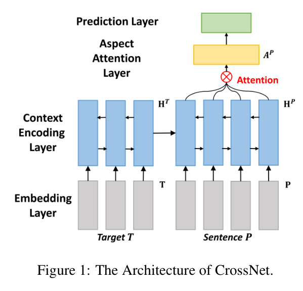

- ACL 2018 short parper
- [code](https://github.com/nuaaxc/cross_target_stance_classification)
- Abstract
    - 大多数立场模型都对每一个target文本训练一个分类器。
    本文探索不同target的分类器的泛化性能
- Introduction
    - 从气候变暖可以迁移到其他相同话题的文本例如环境

    
    

        <em>模型图</em>
    

- Model
    -  context encoding：分别利用双向LSTM对target和sentence进行编码。target的最后时间步
    hidden和cell 作为sentence的输入。
    - aspect attention： 利用一个local attention 提取每个domain相关词
- Experiments
    - 同一个领域：对比实验非SOTA
    - 相似领域的迁移。在一个target训练的模型，在另一个进行预测
    - attention 的词都是领域相关和情感相关词