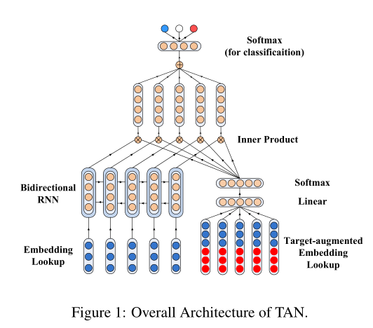

- 立场检测
- Introduction
    - 立场检测是推断一个文本关于某个特定Target的立场，而不是全文的立场
    - 传统的方法都基于抽取的特征或普通的RNN，CNN而忽略了target信息。因此会预测到对非给定target的立场
    - 提出利用注意力机制去抽取文本中与target高度相关的地方
- Model
    - 将词向量与Target向量拼接计算注意力权重
    - 对句子进行双向LSTM编码，然后与注意力信号结合得到文本表示进而分类
- Experiment
    - 在NLPCC和SemEval 两个数据集上都达到了最优
    - 对每一个target的数据都训练一个单独的模型，超参相同
    - 通过注意力可视化可以看到，抽取到的关键词是与target相关的实体和情感词。
-   
