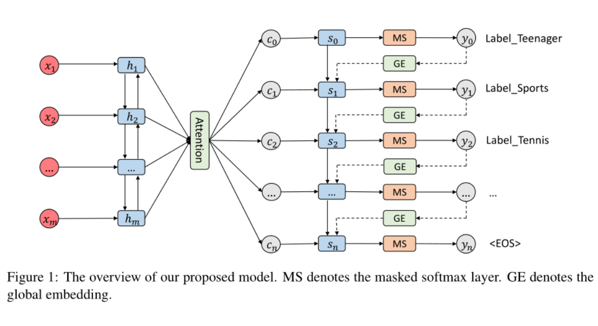

- COLING 2018 Best Paper
- [code](https://github.com/lancopku/SGM)
- Abstract
    - 多标签分类的困难：捕捉标签之间的相关性，根据不同的标签选择重要的词
- Introduction
    -
- Model
    - 预测标签序列，首先将每条样例的标签根据训练集的频率排序。高频的在前面
    分别在标签序列头尾加上<bos>,<eos>
    - Encoder:双向LSTM句子编码
    - Attention：预测不同的标签时应该注重不同的词语，
    所以每次预测t时刻的标签要根据不同的注意力生成句子表示。
    注意力根据句子每个时间步的上下文表示和decoder的当前隐层输出计算。
    - Decoder: 每个时间步的隐层状态根据前一步的隐层状态和句子表示，标签表示计算。
    - 训练时交叉熵损失函数，预测时用beam search

- Experiments
    - 同一个领域：对比实验非SOTA
    - 相似领域的迁移。在一个target训练的模型，在另一个进行预测
    - attention 的词都是领域相关和情感相关词

- 