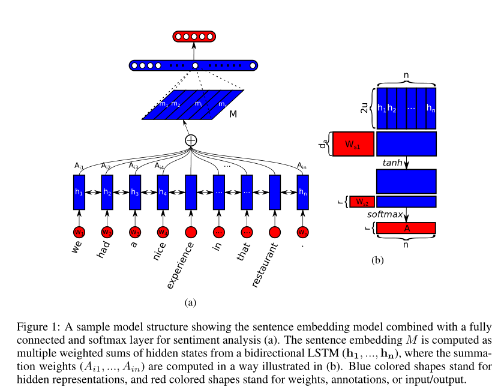

- Introduction
    -
- Model
    - 首先利用双向LSTM进行文本表示H，然后对每个时间步的输出进行两次变化（Wtanh(UH)）。得到注意力矩阵A。
    行代表注意力的hop，列代表文本长度。对每一行进行softmax就可以得到一种注意力得分。
    - 将该注意力矩阵A与文本表示H相乘 得到文本表示矩阵M=AH
    - Penalization Term
        - 计算注意力时可能在r个hop都获得相似的权重，因此需要惩罚项来增加注意力的多样性
        - 衡量两个向量的相似性可以使用KL散度，但在本实验中不稳定。原因可能是最大化KL散度的集合
        （通常应该是最小化一个值）。会使得注意力权重有很多特别小甚至0的值，这导致了训练的不稳定
        而且KL散度不能保证每一个hop的注意力都聚焦在一个位置上。
        - 最小化|AA-I| 矩阵的Frobenius范数，加入到原损失函数中。让每个向量中最高值的位置不同。
- Experiment
    - 用户画像，情感分析，文本匹配
    - 实验分析1.0的惩罚项系数，效果较好，可视化也展示了不同hop的焦点不同
    - hops 数10-30 效果较好
-   
