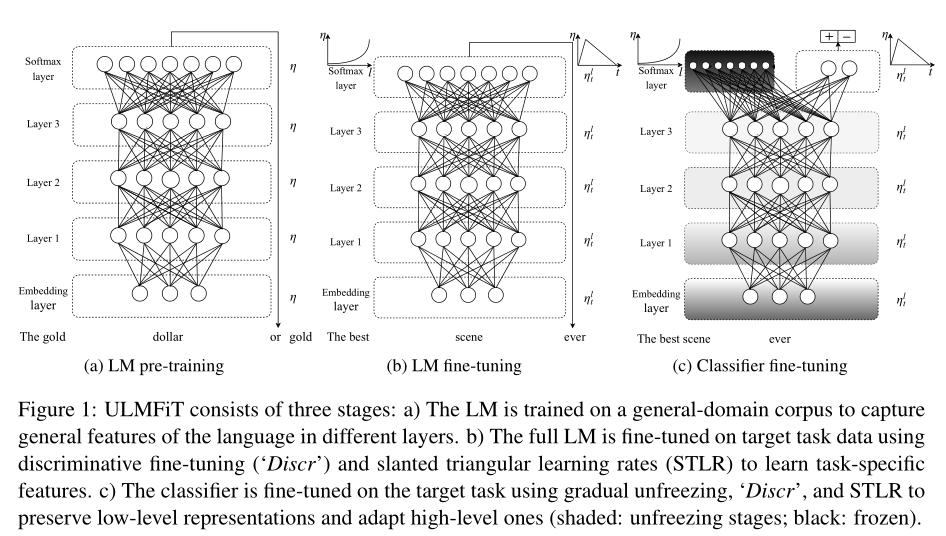
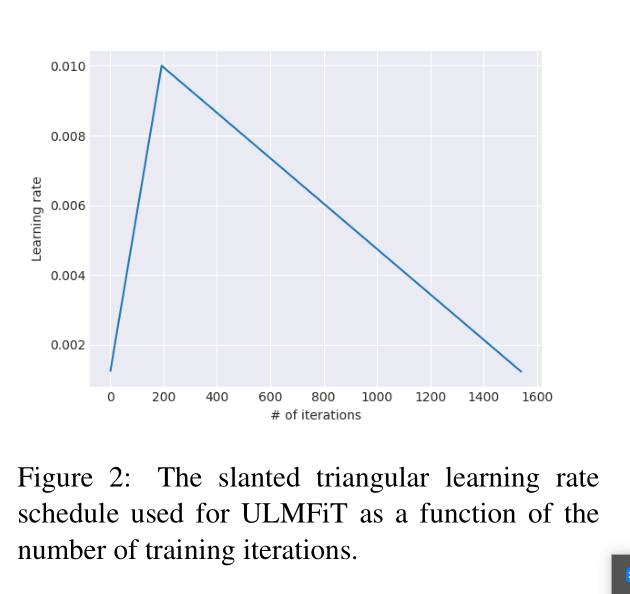
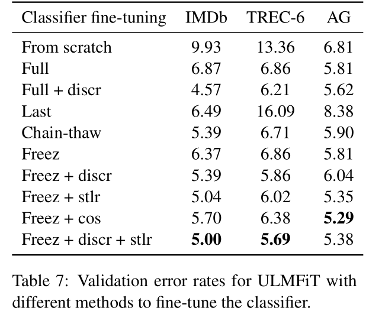

- ACL 2018
- 总结
    - 三阶段的迁移模型进行文本分类。通用语言模型，目标语言模型，目标文本分类。
    - 各个阶段微调的细节
    - 详尽的实验分析
- Introduction
    - Elmo等方法仍然把预训练的词向量当作固定的参数，然后从头训练其余任务特有层，
    - 依靠预训练应该会比随机初始化其余层取得更好的效果。但是inductive transfer在NLP
    中通常相关不好。不是语言模型微调不好，而是没有找到如何有效训练的方法。语言模型
    通常在小数据集上会过拟合，或者在微调分类器时遗忘语言模型。相比于CV，NLP通常更浅
    因此需要不同的微调方法。
- Method
    - 通用领域语言模型预训练
        - 在维基百科上一亿个词预训练语言模型。这一步会对训练数据少的任务很有用。
        很耗时，但只需要训练一次
    - 目标领域语言模型微调
        - 不管第一步使用的通用领域的数据是什么，目标任务的数据一定会有不同的分布。
        - 这一步因为只需要适应目标领域的数据，收敛的会更快。而且对于小数据集也会训练出一个更鲁棒的语言模型
        - **有差别微调**：由于每一个层捕捉的是不同类型的信息，因此应该采取不同的方式微调。
        对于每个层，采用不同的学习率，最后一层学习率最大。
        - **倾斜三角学习率**: 对于特定任务特征的训练，我们更想让模型先快速收敛到一个合适的参数空间
        然后进行微调。在训练的所有阶段使用同样的学习率往往不是最好的方法。倾斜的三角学习率
        首先快速增长到顶点，然后缓慢下降。实验发现这是好结果的关键

    - 目标分类任务微调
        - 在预训练的语言模型后面加入两个额外的线性层。每一块使用了batch norm 和dropout
        relu。 只有这一层的参数是从头训练的
        - 拼接最后一层的隐层输出，最大池化层，平均池化层作为文本表示
        - 分类器微调是最关键的部分。过激的微调会导致丢失预训练从而丢失了预训练捕捉的信息。
        过于谨慎会导致收敛很慢或过拟合。
        - **逐渐解冻**：微调所有层会有记忆遗忘的风险，因为最后一层包含最少的通用知识，从最后一层开始解冻
        首先解冻最后一层，然后对所有解冻的层训练一轮。然后解冻下一层，重复训练。直到所有的层都微调。
        - Backpropagation through time 文本分类，把文档拆成固定长度batch，在每个batah的开始
        根据前一个batch的最后状态初始化模型，梯度反向传到与最后预测先连的隐层状态所属的batch。
        - 双向语言模型：分别预训练一个前向和后向语言模型。然后分别为微调分类器，平均二者的预测

- Analysis
    - 预训练的作用
        - 预训练对于小数据集效果更明显
    - 语言模型质量
        - 预训练普通的LSTM（没有dropout），在大数据集上也有提升效果，但小数据集上过拟合
    - 语言模型微调的影响
        -  有差别微调+倾斜三角 > 差别微调 > 无差别微调 >不微调
    - 分类器微调的影响
        - 逐渐解冻+差别微调+倾斜三角学习率效果最好
        - 图3
    - 分类器微调的表现
        -  _Full_ 方式微调在前几轮就达到了很高的准确率，但是马上就过拟合了。本文提出的方法更加稳定
    - 双向的作用
        - 双向会更耗时，但效果提升0.5-0.7
- 
- 
- 